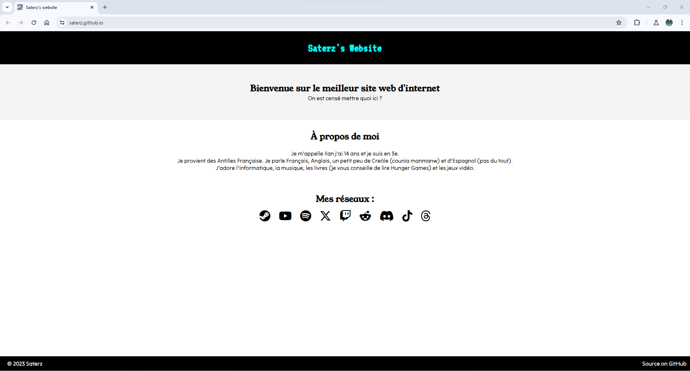

### Mon Site Personnel

<!-- Bienvenue sur mon site personnel ! Ce site est une vitrine pour partager mes projets et faire des expériences.

## Aperçu

## Technologies Utilisées

- HTML5
- CSS3
- Git pour la gestion de versionnement

## Comment Contribuer

Si vous souhaitez contribuer à ce projet, vous pouvez :

- Soumettre des suggestions d'amélioration via les issues GitHub.
- Proposer des correctifs via des pull requests.
- Partager le site avec votre réseau pour le faire connaître.

## Comment Déployer Localement

Pour déployer ce site localement, suivez ces étapes :

1. Clonez ce dépôt sur votre machine locale.
2. Ouvrez le dans Visual Studio Code.
3. Installez l'extension Live Server
3. Lancez un serveur local en appuyant sur l'icône de Live Server en bas à droite.
4. Normalement ça s'ouvre automatiquement mais si non, accédez au site dans votre navigateur à l'adresse `http://localhost:[le port qu'il vous à donner]`.

## Auteur

[Saterz](https://github.com/Saterz)

N'hésitez pas à me contacter si vous avez des questions ou des suggestions !

## Licence

Pour l'instant il n'y a pas de liscence -->
