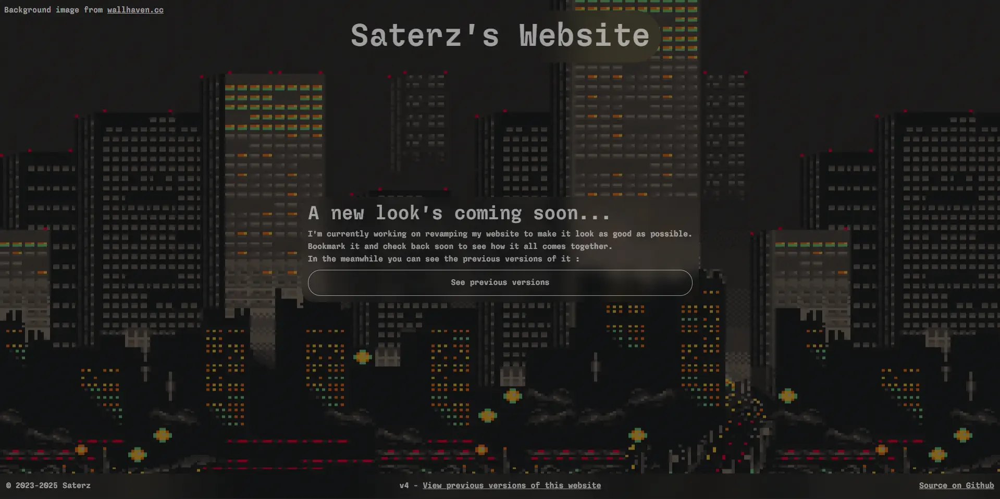

# Saterz's Website

Welcome to the repository for **Saterz's Website**! This is my personal portfolio showcasing my projects, interests, and more.

## 🌐 Live Website

You can visit the live version of the website here: [saterz.dev](https://saterz.dev)

## 🛠️ Technologies Used

### Frontend

- **Vue**
- **Tailwind**
- **Typescript**

## 📸 Screenshots

### Homepage

## 📜 License

This project is open-source and available under the [Apache-2.0 License](LICENSE).

## 🤝 Contributing

Feel free to fork this repository and submit pull requests for improvements or suggestions.

## 📧 Contact

If you have any feedback, feel free to reach out:

- **GitHub**: [Saterz](https://github.com/Saterz)

- **Discord**: [@saterz_](https://discordapp.com/users/655805199801385007)
